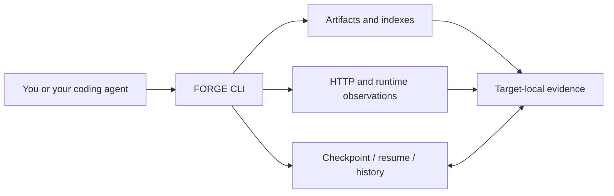

# FORGE

Local evidence and resumable workflows for protocol investigation.

[](https://github.com/hanphanr1/Forge/actions/workflows/ci.yml)
[](pyproject.toml)
[](LICENSE)

FORGE imports client artifacts, indexes source-located strings, captures explicit HTTP flows, and keeps findings in a target-local evidence store. Checkpoints preserve the next experiment across sessions. Response extraction carries tokens between requests without turning the evidence database into a credential store.

Use it directly or from a coding agent with shell access. FORGE does not call a model, require a model API key, or register an MCP server. Your agent still reads request builders, chooses experiments, and writes the target implementation.

[CLI reference](docs/cli.md) · [Agent workflow](WORKFLOW.md) · [HTTP flows](docs/http-flows.md) · [HAR templates](docs/har-flows.md) · [Target controls](docs/target-runs.md) · [Comparisons](docs/comparisons.md) · [GraphQL](docs/graphql.md) · [Native](docs/native.md) · [Android](docs/android.md) · [Bundles](docs/bundles.md) · [Task handoff](docs/checkpoints.md)

## The workflow



The evidence store is local to each target. A resumed task carries its cited findings and next experiment; it does not start an autonomous agent.

## Install

Python 3.10 or newer. The core uses the standard library; runtime tools and the curl transport are optional.

```sh
git clone https://github.com/hanphanr1/Forge.git
cd Forge
python -m venv .venv
```

Activate the environment:

```powershell
# Windows PowerShell
.\.venv\Scripts\Activate.ps1
```

```sh
# Linux / macOS
. .venv/bin/activate
```

Then install from this checkout:

```sh
python -m pip install -e .
forge --version
forge --help
```

If PowerShell blocks activation, invoke `.\.venv\Scripts\python.exe -m pip install -e .` and use `.\.venv\Scripts\forge.exe`; changing machine-wide execution policy is unnecessary.

For explicit curl impersonation support:

```sh
python -m pip install -e ".[http]"
```

You can also run `python forge.py` without installing the package. Third-party binaries, virtual environments and captures are not distributed in this repository.

## Start an investigation

Create a dedicated folder for the target. `--project` selects that existing folder and goes **before** the command. Relative input paths resolve there, not against the shell's current directory.

```sh
mkdir investigation
forge --project investigation doctor
forge --project investigation init --target https://example.invalid --goal "Trace and verify the client login flow"
forge --project investigation status
```

`example.invalid` is an illustrative target, not a supported service. Replace it with the official site identified during your investigation.

Save progress before changing sessions or waiting for a device:

```sh
forge --project investigation checkpoint --phase analyze --state blocked --summary "Located the request builder; runtime capture is still needed" --next "Capture one authorized login on Android" --blocker "Awaiting a connected device" --expect-revision 0
forge --project investigation resume
```

`resume` reports the saved state and file integrity. It does not execute the next action or silently clear blockers. Each checkpoint uses an expected revision to prevent a stale session from overwriting newer work.

## Try a complete local flow

The demo binds to loopback and uses disposable fixture credentials. It does not contact a vendor or accept production credentials.

In one terminal:

```sh
python examples/demo_server.py
```

In another, from the repository root:

```sh
forge --project . probe-run examples/login-flow.json
```

The flow logs in, extracts a token from the JSON response, and sends it with the session cookie to the profile endpoint. Inspect the final exchange's `bucket` and the top-level `stopped` / `stop_reason`; `ok: true` alone does not mean an entire flow succeeded. Stop the demo server when finished.

The flow syntax is explicit:

```json
[
  {
    "url": "http://127.0.0.1:8765/login",
    "method": "POST",
    "json": {"login": "demo", "password": "demo-password"},
    "extract": {"AUTH": {"json_path": "/data/opaque"}}
  },
  {
    "url": "http://127.0.0.1:8765/profile",
    "headers": {"Authorization": "Bearer ${flow.AUTH}"}
  }
]
```

`${ENV_VAR}` reads an explicit environment value. `${flow.AUTH}` reads an earlier extraction within this command. Extraction values remain in command memory and are scrubbed from stored exchanges, including opaque echoes. Missing, malformed or truncated extraction stops the flow before a dependent request. See [HTTP flows](docs/http-flows.md) for selectors, stop precedence and limitations.

## From capture to executed controls

```sh
forge --project investigation har-to-flow capture.har --output flows/from-capture.json
forge --project investigation protocol-map --limit 100
forge --project investigation run-target target-controls.json
forge --project investigation verify-target --positive "<positive-target-run-id>" --negative "<negative-target-run-id>"
```

HAR conversion writes editable request templates and source/output hashes without sending traffic or copying captured URL/header/string values. Fill the returned environment variables and add only selectors/rules supported by observed protocol evidence. See [HAR templates](docs/har-flows.md).

`run-target` executes trusted project code for two explicit controls with bounded stdout/stderr, process deadlines, source hashes and actual executable fingerprints. Optional `stdin_json` keeps credentials out of argv; optional declared `version_argv` records a bounded version probe. All standard buckets remain visible, but only expected HIT/FREE and FAIL controls can pass. `verify-target` rechecks sources and executable bytes. The program reports its bucket; FORGE does not independently attest authentication or IP. See [target controls](docs/target-runs.md).

`protocol-map` summarizes stored URLs, methods, header/field names and source citations. Static candidates, imported captures and live HTTP observations stay separate; it neither opens raw captures nor probes endpoints. See [protocol map](docs/protocol-map.md).

## Compare versions and hand off evidence

```sh
forge --project investigation protocol-snapshot --evidence "<observed-exchange-id>"
forge --project investigation protocol-diff --before "<snapshot-id>" --after "<snapshot-id>"
forge --project investigation client-diff --before "<artifact-or-index-id>" --after "<artifact-or-index-id>"
forge --project investigation graphql-analyze client.graphql
forge --project investigation bundle --evidence "<finding-or-verification-id>" --output handoff/review.zip
```

Protocol snapshots retain citations and omission flags; their diffs distinguish field/status/provenance changes from server claims. Client comparisons inspect stored artifact bytes or explicitly labeled redacted-index projections. GraphQL analysis extracts operations, variables, fields and fragments without exporting literals or contacting a schema endpoint. Bundles follow bounded citation closure and withhold capture payloads, process streams, paths, blobs and free-text findings by default. Review metadata before disclosure. See [comparisons](docs/comparisons.md), [GraphQL](docs/graphql.md) and [bundles](docs/bundles.md).


## What is included

| Area | Commands | Boundary |
|---|---|---|
| Task handoff | `init`, `status`, `checkpoint`, `resume`, `history` | Agent-reported progress, not automatic verification |
| Artifacts | `artifact-add`, `artifact-fetch`, `artifact-index`, `search` | Bounded readers; strings are candidates, not live protocol proof |
| Runtime | `jadx`, `native`, `adb`, `adb-preflight`, `adb-install-splits`, `apk-info`, `frida`, `doctor` | Actual installed tools; split selection and compatible authorized hardware are explicit |
| HTTP | `probe`, `probe-run`, `har-import`, `har-to-flow`, `diff` | Explicit requests and editable capture templates; no automatic retries or replay |
| Implementation | `run-target`, `verify-target` | Trusted-code execution and declared controls; not a sandbox or independent authentication proof |
| Protocol | `protocol-map`, `protocol-snapshot`, `protocol-diff`, `graphql-analyze` | Cited provenance and local structural analysis, not schema/authentication inference |
| Client versions | `client-diff` | Stored artifact bytes or labeled index-projection differences, not server-change proof |
| Evidence | `claim`, `evidence`, `show`, `verify`, `report`, `bundle` | Scoped gates and explicit lossy metadata handoffs |

Artifacts keep SHA-256, origin and source locations. HTTP rules classify observed response bodies rather than guessing from a status code. The first matching rule wins; an unmatched response is `UNKNOWN`. `TERMINAL` stops deterministic refusals instead of retrying them.

## Runtime tools

Install only what the investigation needs:

- [JADX](https://github.com/skylot/jadx) and a compatible Java runtime for Android decompilation.
- [Android Platform Tools](https://developer.android.com/tools/releases/platform-tools) for ADB.
- [Frida](https://frida.re/docs/installation/) for an explicit hook script and compatible target setup.
- [radare2](https://github.com/radareorg/radare2) for native inspection.

Tool discovery checks an explicit `FORGE_*` override, a portable tool directory beside the source modules, then `PATH`. A broken override fails rather than selecting a different executable. `doctor` reports the actual resolution. See [toolchain setup](docs/toolchain.md).

Android requires an authorized device or an environment you have deliberately configured. `apk-info` reads compiled manifest metadata from explicit APKs or exact archive members without installing. `adb-preflight` observes serial/OS/API/ABI and classifies missing prerequisites; `adb packages`/`adb package` locate an installed app and `adb pull`/`adb push` move one explicit artifact in or out of a new project-local path. `adb-install-splits` validates explicitly selected APKs/APKS/XAPK members and uses new-install-only dispatch; it does not replace apps or grant permissions. `jadx` keeps usable source when an obfuscated APK finishes with per-class errors. Deep native actions expose bounded disassembly, xrefs and function-level call-reference graphs backed by observed radare2 data. `frida` checks device reachability first and names the missing prerequisite: a jailed Android needs a repackaged Gadget, otherwise a reachable device-side `frida-server`. None of this downloads SDKs, changes device security or supplies an iOS adapter. See [Android](docs/android.md) and [native analysis](docs/native.md).

## Evidence and privacy

Each target stores data under `.forge/`:

```text
.forge/
  evidence.sqlite3   # cited task, analysis and exchange records
  blobs/             # original artifact bytes and explicit runtime captures
  indexes/           # bounded static indexes
  analysis/          # tool output such as JADX decompilation
```

The database is not a source for replaying credentials. Redaction is best-effort: unknown unlabeled secrets, raw artifacts and screenshots may still contain private data. Keep the store local, inspect exports, and do not commit captures or credentials. Checkpoint file entries contain paths and hashes, not file contents.

`verify` requires distinct live positive and negative exchanges with complete responses, matching endpoint/transport and matching declared client/egress identifiers. It **does not** execute an implementation. Use `run-target` and `verify-target` for declared process controls; these still do not independently measure egress or verify every server branch.

## Development

```sh
python -m unittest discover -s tests -v
python -m pip wheel . --no-deps --wheel-dir dist
python examples/smoke.py
python examples/smoke.py --transport curl_cffi
```

CI runs the regression suite and actual CLI smoke on Windows, Linux and macOS: reviewed HAR replay, JSON-stdin implementation controls, executable/version fingerprints, changed-source rejection, cited protocol/client diffs, GraphQL value exclusion and bundle member hashes. It then builds and exercises the installed wheel. Native/device checks require their actual dependencies and hardware; parser/dispatch fixtures are not installation proof. See [CONTRIBUTING.md](CONTRIBUTING.md) for the change and release procedure.

## Author and license

Created and maintained by [hanphanr1](https://github.com/hanphanr1).

[MIT License](LICENSE). Optional third-party tools retain their own licenses.
